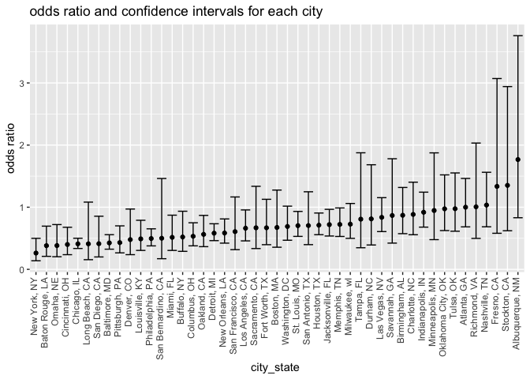
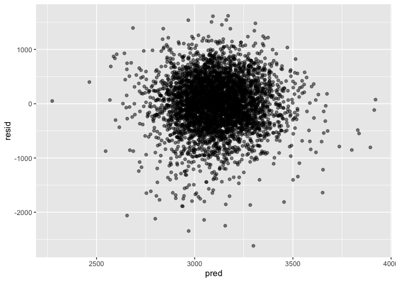
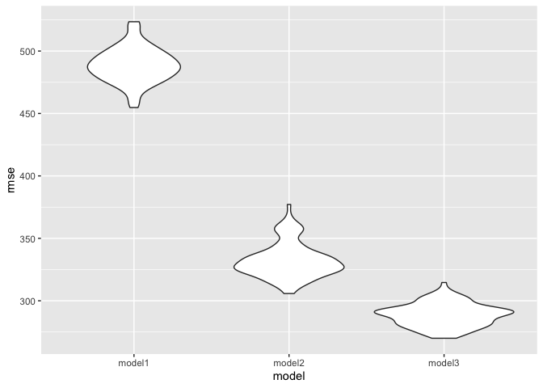

hw6
================
Ruihan Zhang
2022-11-30

``` r
library(tidyverse)
```

    ## ── Attaching packages ─────────────────────────────────────── tidyverse 1.3.2 ──
    ## ✔ ggplot2 3.3.6      ✔ purrr   0.3.4 
    ## ✔ tibble  3.1.8      ✔ dplyr   1.0.10
    ## ✔ tidyr   1.2.0      ✔ stringr 1.4.1 
    ## ✔ readr   2.1.2      ✔ forcats 0.5.2 
    ## ── Conflicts ────────────────────────────────────────── tidyverse_conflicts() ──
    ## ✖ dplyr::filter() masks stats::filter()
    ## ✖ dplyr::lag()    masks stats::lag()

``` r
library(viridis)
```

    ## Loading required package: viridisLite

``` r
library(dplyr)
library(purrr)
library(broom)
library(plotly)
```

    ## 
    ## Attaching package: 'plotly'
    ## 
    ## The following object is masked from 'package:ggplot2':
    ## 
    ##     last_plot
    ## 
    ## The following object is masked from 'package:stats':
    ## 
    ##     filter
    ## 
    ## The following object is masked from 'package:graphics':
    ## 
    ##     layout

``` r
library(modelr)
```

    ## 
    ## Attaching package: 'modelr'
    ## 
    ## The following object is masked from 'package:broom':
    ## 
    ##     bootstrap

``` r
library(mgcv)
```

    ## Loading required package: nlme
    ## 
    ## Attaching package: 'nlme'
    ## 
    ## The following object is masked from 'package:dplyr':
    ## 
    ##     collapse
    ## 
    ## This is mgcv 1.8-40. For overview type 'help("mgcv-package")'.

``` r
set.seed(1)
```

``` r
homicide= read_csv("./data/homicide-data.csv") %>% 
  janitor::clean_names() %>% 
  mutate(city_state = str_c(city,", ",state)) %>% 
  mutate(outcome = case_when(disposition == "Closed without arrest" ~ 'not solved',
                           disposition == 'Closed by arrest' ~ 'solved',
                           disposition == "Open/No arrest" ~ 'not solved')
  ) %>% 
  filter(city_state != "Dallas, TX",
         city_state != "Phoenix, AZ",
         city_state != "Kansas City, MO",
         city_state != "Tulsa, AL",
         ) %>% 
  filter(victim_race == "White" | victim_race == "Black") %>% 
  mutate(., victim_age = as.numeric(victim_age))
```

    ## Rows: 52179 Columns: 12
    ## ── Column specification ────────────────────────────────────────────────────────
    ## Delimiter: ","
    ## chr (9): uid, victim_last, victim_first, victim_race, victim_age, victim_sex...
    ## dbl (3): reported_date, lat, lon
    ## 
    ## ℹ Use `spec()` to retrieve the full column specification for this data.
    ## ℹ Specify the column types or set `show_col_types = FALSE` to quiet this message.

    ## Warning in mask$eval_all_mutate(quo): NAs introduced by coercion

``` r
Baltimore = homicide %>% 
  filter(city_state == "Baltimore, MD") %>% 
  mutate(outcome = case_when(outcome ==  'not solved' ~ "0",
                           outcome ==  'solved' ~ "1")) %>% 
  mutate(outcome = as.numeric(outcome))
```

``` r
sink("fit.txt")
 fit = glm(formula = outcome~victim_race+victim_age+victim_sex, family = binomial(), data = Baltimore)
 print(fit)
```

    ## 
    ## Call:  glm(formula = outcome ~ victim_race + victim_age + victim_sex, 
    ##     family = binomial(), data = Baltimore)
    ## 
    ## Coefficients:
    ##      (Intercept)  victim_raceWhite        victim_age    victim_sexMale  
    ##         0.309981          0.841756         -0.006727         -0.854463  
    ## 
    ## Degrees of Freedom: 2752 Total (i.e. Null);  2749 Residual
    ## Null Deviance:       3568 
    ## Residual Deviance: 3493  AIC: 3501

``` r
 sink()
```

``` r
mf = fit %>%  broom::tidy() %>% 
  mutate(
    OR = exp(estimate),
    lower_ci = exp(estimate - 1.96 * std.error),
    upper_ci = exp(estimate + 1.96 * std.error)
  ) %>% 
  select(term, estimate, OR, lower_ci,upper_ci ) %>% 
  knitr::kable(digits = 3)

mf
```

| term             | estimate |    OR | lower_ci | upper_ci |
|:-----------------|---------:|------:|---------:|---------:|
| (Intercept)      |    0.310 | 1.363 |    0.975 |    1.907 |
| victim_raceWhite |    0.842 | 2.320 |    1.648 |    3.268 |
| victim_age       |   -0.007 | 0.993 |    0.987 |    1.000 |
| victim_sexMale   |   -0.854 | 0.426 |    0.325 |    0.558 |

``` r
city_nest = homicide %>% 
  select(city_state, victim_race, victim_age, victim_sex, outcome) %>% 
  mutate(outcome = case_when(outcome ==  'not solved' ~ "0",
                           outcome ==  'solved' ~ "1")) %>% 
  mutate(outcome = as.numeric(outcome)) %>% 
  nest(data = victim_race:outcome)
```

``` r
city_nest %>% pull(data)
```

    ## [[1]]
    ## # A tibble: 178 × 4
    ##    victim_race victim_age victim_sex outcome
    ##    <chr>            <dbl> <chr>        <dbl>
    ##  1 White               15 Female           0
    ##  2 White               72 Female           0
    ##  3 White               91 Female           0
    ##  4 White               56 Male             0
    ##  5 White               NA Male             0
    ##  6 White               43 Female           1
    ##  7 White               52 Male             1
    ##  8 White               22 Female           1
    ##  9 Black               15 Male             1
    ## 10 Black               25 Male             1
    ## # … with 168 more rows
    ## 
    ## [[2]]
    ## # A tibble: 945 × 4
    ##    victim_race victim_age victim_sex outcome
    ##    <chr>            <dbl> <chr>        <dbl>
    ##  1 Black               29 Male             1
    ##  2 Black               29 Male             1
    ##  3 Black               26 Male             1
    ##  4 Black               75 Male             0
    ##  5 Black               22 Male             0
    ##  6 Black               40 Male             1
    ##  7 Black                1 Female           1
    ##  8 Black               25 Male             1
    ##  9 Black               25 Male             0
    ## 10 Black               46 Male             1
    ## # … with 935 more rows
    ## 
    ## [[3]]
    ## # A tibble: 2,753 × 4
    ##    victim_race victim_age victim_sex outcome
    ##    <chr>            <dbl> <chr>        <dbl>
    ##  1 Black               17 Male             0
    ##  2 Black               26 Male             0
    ##  3 Black               21 Male             0
    ##  4 White               61 Male             1
    ##  5 Black               46 Male             1
    ##  6 Black               27 Male             1
    ##  7 Black               21 Male             1
    ##  8 Black               16 Male             1
    ##  9 Black               21 Male             1
    ## 10 Black               44 Female           1
    ## # … with 2,743 more rows
    ## 
    ## [[4]]
    ## # A tibble: 410 × 4
    ##    victim_race victim_age victim_sex outcome
    ##    <chr>            <dbl> <chr>        <dbl>
    ##  1 Black               38 Male             0
    ##  2 Black               46 Male             0
    ##  3 Black               30 Male             0
    ##  4 Black               14 Male             1
    ##  5 Black               21 Male             0
    ##  6 Black               25 Female           1
    ##  7 Black               23 Male             1
    ##  8 Black               27 Male             1
    ##  9 Black               63 Male             0
    ## 10 Black               38 Female           1
    ## # … with 400 more rows
    ## 
    ## [[5]]
    ## # A tibble: 771 × 4
    ##    victim_race victim_age victim_sex outcome
    ##    <chr>            <dbl> <chr>        <dbl>
    ##  1 Black               37 Male             0
    ##  2 Black               37 Male             1
    ##  3 White               26 Male             0
    ##  4 Black               35 Male             1
    ##  5 Black               46 Male             0
    ##  6 Black               29 Male             1
    ##  7 Black               33 Male             0
    ##  8 Black               34 Male             0
    ##  9 Black               41 Male             0
    ## 10 Black               23 Male             1
    ## # … with 761 more rows
    ## 
    ## [[6]]
    ## # A tibble: 492 × 4
    ##    victim_race victim_age victim_sex outcome
    ##    <chr>            <dbl> <chr>        <dbl>
    ##  1 Black               26 Male             0
    ##  2 Black               30 Male             0
    ##  3 Black               19 Male             0
    ##  4 Black               76 Male             0
    ##  5 Black               22 Male             0
    ##  6 White                4 Female           0
    ##  7 Black               15 Male             1
    ##  8 Black               29 Male             1
    ##  9 White               32 Male             1
    ## 10 Black               26 Male             1
    ## # … with 482 more rows
    ## 
    ## [[7]]
    ## # A tibble: 479 × 4
    ##    victim_race victim_age victim_sex outcome
    ##    <chr>            <dbl> <chr>        <dbl>
    ##  1 Black               18 Female           0
    ##  2 Black               17 Male             0
    ##  3 Black               20 Male             1
    ##  4 Black               22 Male             1
    ##  5 White               38 Male             1
    ##  6 Black               18 Male             0
    ##  7 Black               23 Male             1
    ##  8 Black               32 Male             1
    ##  9 Black               26 Male             0
    ## 10 Black               30 Male             1
    ## # … with 469 more rows
    ## 
    ## [[8]]
    ## # A tibble: 584 × 4
    ##    victim_race victim_age victim_sex outcome
    ##    <chr>            <dbl> <chr>        <dbl>
    ##  1 Black               63 Female           1
    ##  2 Black               65 Male             1
    ##  3 Black               17 Male             1
    ##  4 Black               55 Male             1
    ##  5 Black               21 Female           1
    ##  6 Black               17 Male             0
    ##  7 Black               37 Male             1
    ##  8 Black               31 Male             1
    ##  9 Black               28 Male             1
    ## 10 Black               20 Male             0
    ## # … with 574 more rows
    ## 
    ## [[9]]
    ## # A tibble: 4,507 × 4
    ##    victim_race victim_age victim_sex outcome
    ##    <chr>            <dbl> <chr>        <dbl>
    ##  1 Black               36 Male             1
    ##  2 Black               31 Male             0
    ##  3 Black               21 Male             1
    ##  4 White               34 Male             1
    ##  5 Black               37 Male             0
    ##  6 White               31 Male             0
    ##  7 Black               38 Male             0
    ##  8 Black               29 Male             1
    ##  9 Black               31 Male             0
    ## 10 Black               24 Female           0
    ## # … with 4,497 more rows
    ## 
    ## [[10]]
    ## # A tibble: 679 × 4
    ##    victim_race victim_age victim_sex outcome
    ##    <chr>            <dbl> <chr>        <dbl>
    ##  1 Black               26 Female           0
    ##  2 Black               21 Male             1
    ##  3 White               47 Female           0
    ##  4 Black               14 Male             0
    ##  5 Black               26 Male             0
    ##  6 Black               21 Male             0
    ##  7 White                0 Male             1
    ##  8 Black               26 Male             0
    ##  9 Black               51 Male             1
    ## 10 Black               24 Male             0
    ## # … with 669 more rows
    ## 
    ## [[11]]
    ## # A tibble: 1,026 × 4
    ##    victim_race victim_age victim_sex outcome
    ##    <chr>            <dbl> <chr>        <dbl>
    ##  1 White               59 Female           0
    ##  2 Black               21 Male             1
    ##  3 White               51 Male             0
    ##  4 Black               15 Male             0
    ##  5 Black               30 Male             0
    ##  6 Black               32 Female           1
    ##  7 Black               10 Female           1
    ##  8 Black                7 Female           1
    ##  9 Black               21 Male             1
    ## 10 Black               45 Male             1
    ## # … with 1,016 more rows
    ## 
    ## [[12]]
    ## # A tibble: 208 × 4
    ##    victim_race victim_age victim_sex outcome
    ##    <chr>            <dbl> <chr>        <dbl>
    ##  1 White               38 Male             0
    ##  2 Black               19 Male             0
    ##  3 Black               21 Male             0
    ##  4 White               30 Female           0
    ##  5 White               83 Female           1
    ##  6 White                0 Male             1
    ##  7 Black               73 Male             0
    ##  8 Black               17 Male             1
    ##  9 Black               21 Female           0
    ## 10 White               40 Male             0
    ## # … with 198 more rows
    ## 
    ## [[13]]
    ## # A tibble: 2,457 × 4
    ##    victim_race victim_age victim_sex outcome
    ##    <chr>            <dbl> <chr>        <dbl>
    ##  1 White               60 Male             1
    ##  2 Black               20 Male             0
    ##  3 Black               30 Male             0
    ##  4 Black               24 Female           0
    ##  5 Black               33 Male             1
    ##  6 Black               26 Male             0
    ##  7 White               28 Male             0
    ##  8 Black               33 Male             1
    ##  9 Black               28 Male             0
    ## 10 Black               35 Male             1
    ## # … with 2,447 more rows
    ## 
    ## [[14]]
    ## # A tibble: 230 × 4
    ##    victim_race victim_age victim_sex outcome
    ##    <chr>            <dbl> <chr>        <dbl>
    ##  1 Black               25 Female           1
    ##  2 White               62 Male             1
    ##  3 Black                0 Male             1
    ##  4 Black               14 Female           1
    ##  5 Black               49 Male             0
    ##  6 Black               19 Male             1
    ##  7 Black               15 Male             1
    ##  8 Black               39 Male             0
    ##  9 Black               26 Male             1
    ## 10 Black               25 Male             1
    ## # … with 220 more rows
    ## 
    ## [[15]]
    ## # A tibble: 383 × 4
    ##    victim_race victim_age victim_sex outcome
    ##    <chr>            <dbl> <chr>        <dbl>
    ##  1 Black               22 Male             0
    ##  2 Black               22 Male             1
    ##  3 Black               20 Male             1
    ##  4 White               49 Female           0
    ##  5 White               21 Female           0
    ##  6 Black               22 Female           1
    ##  7 Black               24 Male             1
    ##  8 White               46 Male             0
    ##  9 Black               21 Male             0
    ## 10 Black               20 Male             0
    ## # … with 373 more rows
    ## 
    ## [[16]]
    ## # A tibble: 210 × 4
    ##    victim_race victim_age victim_sex outcome
    ##    <chr>            <dbl> <chr>        <dbl>
    ##  1 Black               22 Male             0
    ##  2 White               33 Female           0
    ##  3 Black               19 Male             1
    ##  4 Black               26 Male             0
    ##  5 Black               26 Male             1
    ##  6 Black               48 Male             0
    ##  7 Black               21 Male             1
    ##  8 Black               17 Male             0
    ##  9 Black               49 Male             0
    ## 10 Black               31 Male             0
    ## # … with 200 more rows
    ## 
    ## [[17]]
    ## # A tibble: 1,887 × 4
    ##    victim_race victim_age victim_sex outcome
    ##    <chr>            <dbl> <chr>        <dbl>
    ##  1 White               48 Male             1
    ##  2 Black               42 Male             1
    ##  3 Black               28 Male             1
    ##  4 Black               23 Male             1
    ##  5 Black               30 Male             1
    ##  6 White               NA Male             0
    ##  7 Black               26 Male             1
    ##  8 White               27 Male             1
    ##  9 Black               57 Male             1
    ## 10 Black               30 Male             1
    ## # … with 1,877 more rows
    ## 
    ## [[18]]
    ## # A tibble: 1,237 × 4
    ##    victim_race victim_age victim_sex outcome
    ##    <chr>            <dbl> <chr>        <dbl>
    ##  1 Black               21 Male             0
    ##  2 Black               35 Male             0
    ##  3 White               27 Male             1
    ##  4 Black               59 Female           0
    ##  5 Black               19 Male             0
    ##  6 White               47 Male             1
    ##  7 Black               52 Male             0
    ##  8 White               58 Male             0
    ##  9 Black               36 Female           0
    ## 10 Black               34 Female           1
    ## # … with 1,227 more rows
    ## 
    ## [[19]]
    ## # A tibble: 1,138 × 4
    ##    victim_race victim_age victim_sex outcome
    ##    <chr>            <dbl> <chr>        <dbl>
    ##  1 Black               46 Female           0
    ##  2 Black               19 Male             1
    ##  3 White               37 Female           1
    ##  4 White               43 Male             1
    ##  5 White               52 Female           0
    ##  6 Black               53 Male             0
    ##  7 White               58 Male             1
    ##  8 White               57 Female           1
    ##  9 Black               19 Male             1
    ## 10 White               38 Female           1
    ## # … with 1,128 more rows
    ## 
    ## [[20]]
    ## # A tibble: 909 × 4
    ##    victim_race victim_age victim_sex outcome
    ##    <chr>            <dbl> <chr>        <dbl>
    ##  1 Black               19 Male             1
    ##  2 White               27 Female           0
    ##  3 Black               23 Male             0
    ##  4 Black               20 Female           1
    ##  5 Black               25 Male             0
    ##  6 White               46 Female           1
    ##  7 Black               65 Female           1
    ##  8 White               45 Male             1
    ##  9 Black               19 Male             1
    ## 10 Black               47 Male             0
    ## # … with 899 more rows
    ## 
    ## [[21]]
    ## # A tibble: 186 × 4
    ##    victim_race victim_age victim_sex outcome
    ##    <chr>            <dbl> <chr>        <dbl>
    ##  1 Black               44 Female           1
    ##  2 Black               39 Female           1
    ##  3 Black               37 Male             0
    ##  4 Black               20 Male             0
    ##  5 Black               47 Male             1
    ##  6 Black               19 Male             1
    ##  7 Black               52 Male             1
    ##  8 Black               22 Male             0
    ##  9 Black                2 Male             0
    ## 10 Black               23 Male             1
    ## # … with 176 more rows
    ## 
    ## [[22]]
    ## # A tibble: 1,078 × 4
    ##    victim_race victim_age victim_sex outcome
    ##    <chr>            <dbl> <chr>        <dbl>
    ##  1 Black               41 Male             1
    ##  2 White               65 Male             0
    ##  3 Black               64 Male             1
    ##  4 Black               35 Male             0
    ##  5 White               40 Female           1
    ##  6 Black               21 Male             0
    ##  7 White               29 Male             1
    ##  8 White               27 Male             1
    ##  9 Black               45 Male             0
    ## 10 Black               23 Male             0
    ## # … with 1,068 more rows
    ## 
    ## [[23]]
    ## # A tibble: 550 × 4
    ##    victim_race victim_age victim_sex outcome
    ##    <chr>            <dbl> <chr>        <dbl>
    ##  1 White               38 Male             1
    ##  2 Black                8 Male             1
    ##  3 White               15 Male             0
    ##  4 Black               26 Male             0
    ##  5 Black               37 Female           1
    ##  6 Black               35 Male             0
    ##  7 White               35 Female           1
    ##  8 White               50 Male             1
    ##  9 Black               63 Male             0
    ## 10 White               36 Male             1
    ## # … with 540 more rows
    ## 
    ## [[24]]
    ## # A tibble: 1,421 × 4
    ##    victim_race victim_age victim_sex outcome
    ##    <chr>            <dbl> <chr>        <dbl>
    ##  1 Black               28 Male             1
    ##  2 Black               18 Male             1
    ##  3 Black               34 Male             1
    ##  4 Black               24 Female           1
    ##  5 Black               21 Male             0
    ##  6 Black               42 Female           1
    ##  7 Black                0 Female           1
    ##  8 Black               24 Male             1
    ##  9 Black               29 Male             1
    ## 10 Black               30 Male             0
    ## # … with 1,411 more rows
    ## 
    ## [[25]]
    ## # A tibble: 438 × 4
    ##    victim_race victim_age victim_sex outcome
    ##    <chr>            <dbl> <chr>        <dbl>
    ##  1 Black               NA Male             0
    ##  2 Black               30 Male             0
    ##  3 Black               24 Male             1
    ##  4 Black               48 Male             1
    ##  5 White               56 Male             1
    ##  6 Black                2 Male             1
    ##  7 Black                4 Female           1
    ##  8 Black               38 Male             0
    ##  9 Black               26 Male             0
    ## 10 Black               16 Male             0
    ## # … with 428 more rows
    ## 
    ## [[26]]
    ## # A tibble: 994 × 4
    ##    victim_race victim_age victim_sex outcome
    ##    <chr>            <dbl> <chr>        <dbl>
    ##  1 White               59 Female           0
    ##  2 White               22 Male             1
    ##  3 White               39 Female           0
    ##  4 White               40 Female           1
    ##  5 White               41 Male             1
    ##  6 Black               33 Male             1
    ##  7 White                1 Male             1
    ##  8 White               34 Female           1
    ##  9 Black               24 Male             1
    ## 10 White                3 Male             1
    ## # … with 984 more rows
    ## 
    ## [[27]]
    ## # A tibble: 299 × 4
    ##    victim_race victim_age victim_sex outcome
    ##    <chr>            <dbl> <chr>        <dbl>
    ##  1 Black               20 Male             0
    ##  2 White               23 Male             1
    ##  3 Black               31 Male             1
    ##  4 Black               27 Male             0
    ##  5 Black               19 Male             0
    ##  6 Black               30 Male             0
    ##  7 Black               35 Male             0
    ##  8 White               44 Male             1
    ##  9 Black               30 Male             0
    ## 10 Black               34 Male             1
    ## # … with 289 more rows
    ## 
    ## [[28]]
    ## # A tibble: 746 × 4
    ##    victim_race victim_age victim_sex outcome
    ##    <chr>            <dbl> <chr>        <dbl>
    ##  1 Black               25 Female           0
    ##  2 Black               23 Female           1
    ##  3 Black               32 Male             0
    ##  4 White               25 Male             0
    ##  5 Black               26 Male             1
    ##  6 White               24 Male             1
    ##  7 White               67 Male             0
    ##  8 Black                0 Male             1
    ##  9 Black               49 Male             1
    ## 10 Black               24 Male             1
    ## # … with 736 more rows
    ## 
    ## [[29]]
    ## # A tibble: 1,353 × 4
    ##    victim_race victim_age victim_sex outcome
    ##    <chr>            <dbl> <chr>        <dbl>
    ##  1 Black               23 Male             1
    ##  2 Black               21 Male             0
    ##  3 Black               33 Male             1
    ##  4 White               21 Male             0
    ##  5 Black               28 Male             1
    ##  6 Black               21 Male             1
    ##  7 Black               30 Female           1
    ##  8 Black               25 Female           1
    ##  9 Black               37 Male             1
    ## 10 Black               25 Male             0
    ## # … with 1,343 more rows
    ## 
    ## [[30]]
    ## # A tibble: 412 × 4
    ##    victim_race victim_age victim_sex outcome
    ##    <chr>            <dbl> <chr>        <dbl>
    ##  1 Black               39 Female           1
    ##  2 Black               27 Male             0
    ##  3 Black               25 Male             0
    ##  4 Black               29 Male             1
    ##  5 Black               33 Male             0
    ##  6 Black               44 Male             1
    ##  7 Black               34 Male             1
    ##  8 Black               18 Male             1
    ##  9 White               43 Male             1
    ## 10 Black               37 Male             0
    ## # … with 402 more rows
    ## 
    ## [[31]]
    ## # A tibble: 740 × 4
    ##    victim_race victim_age victim_sex outcome
    ##    <chr>            <dbl> <chr>        <dbl>
    ##  1 White               62 Male             1
    ##  2 Black               57 Male             0
    ##  3 Black               52 Male             1
    ##  4 Black               19 Male             1
    ##  5 Black               30 Male             1
    ##  6 Black               21 Female           0
    ##  7 Black               26 Female           1
    ##  8 Black               30 Male             0
    ##  9 Black               32 Male             0
    ## 10 Black               45 Male             1
    ## # … with 730 more rows
    ## 
    ## [[32]]
    ## # A tibble: 522 × 4
    ##    victim_race victim_age victim_sex outcome
    ##    <chr>            <dbl> <chr>        <dbl>
    ##  1 White               27 Male             0
    ##  2 White               25 Male             0
    ##  3 Black               20 Male             1
    ##  4 White               43 Female           1
    ##  5 White               39 Female           1
    ##  6 White               36 Male             1
    ##  7 Black               35 Female           1
    ##  8 White               25 Male             1
    ##  9 Black                6 Male             1
    ## 10 White               19 Male             1
    ## # … with 512 more rows
    ## 
    ## [[33]]
    ## # A tibble: 365 × 4
    ##    victim_race victim_age victim_sex outcome
    ##    <chr>            <dbl> <chr>        <dbl>
    ##  1 White               42 Female           1
    ##  2 White               39 Male             1
    ##  3 Black               21 Male             0
    ##  4 Black               22 Male             1
    ##  5 White               NA Female           1
    ##  6 White               45 Male             1
    ##  7 Black               54 Female           0
    ##  8 Black               16 Male             0
    ##  9 Black               18 Male             0
    ## 10 Black               37 Male             0
    ## # … with 355 more rows
    ## 
    ## [[34]]
    ## # A tibble: 2,615 × 4
    ##    victim_race victim_age victim_sex outcome
    ##    <chr>            <dbl> <chr>        <dbl>
    ##  1 Black               45 Male             1
    ##  2 Black               17 Male             1
    ##  3 White               22 Female           1
    ##  4 Black               37 Male             1
    ##  5 Black               25 Male             1
    ##  6 Black               48 Female           1
    ##  7 Black               21 Male             1
    ##  8 Black               22 Male             1
    ##  9 Black               41 Male             1
    ## 10 White               81 Female           1
    ## # … with 2,605 more rows
    ## 
    ## [[35]]
    ## # A tibble: 623 × 4
    ##    victim_race victim_age victim_sex outcome
    ##    <chr>            <dbl> <chr>        <dbl>
    ##  1 Black               73 Male             1
    ##  2 Black               25 Male             0
    ##  3 Black               59 Male             0
    ##  4 Black               42 Male             1
    ##  5 White                0 Female           1
    ##  6 Black               21 Male             0
    ##  7 Black               14 Male             0
    ##  8 Black               18 Male             1
    ##  9 Black                6 Male             1
    ## 10 Black               19 Male             0
    ## # … with 613 more rows
    ## 
    ## [[36]]
    ## # A tibble: 408 × 4
    ##    victim_race victim_age victim_sex outcome
    ##    <chr>            <dbl> <chr>        <dbl>
    ##  1 Black               41 Male             0
    ##  2 Black               42 Female           0
    ##  3 Black               20 Female           1
    ##  4 Black               26 Male             0
    ##  5 Black               34 Male             1
    ##  6 Black               26 Male             0
    ##  7 Black               38 Male             1
    ##  8 Black               26 Male             1
    ##  9 Black               36 Female           0
    ## 10 Black               58 Male             0
    ## # … with 398 more rows
    ## 
    ## [[37]]
    ## # A tibble: 310 × 4
    ##    victim_race victim_age victim_sex outcome
    ##    <chr>            <dbl> <chr>        <dbl>
    ##  1 Black               27 Male             0
    ##  2 Black               22 Male             1
    ##  3 White               23 Male             1
    ##  4 Black               13 Male             0
    ##  5 White               68 Female           1
    ##  6 Black               35 Female           1
    ##  7 White               47 Female           1
    ##  8 Black               22 Male             0
    ##  9 Black               26 Male             0
    ## 10 Black               40 Male             1
    ## # … with 300 more rows
    ## 
    ## [[38]]
    ## # A tibble: 236 × 4
    ##    victim_race victim_age victim_sex outcome
    ##    <chr>            <dbl> <chr>        <dbl>
    ##  1 Black               26 Male             1
    ##  2 Black               30 Female           1
    ##  3 Black               23 Male             0
    ##  4 White               61 Male             1
    ##  5 Black               17 Male             1
    ##  6 Black               17 Male             0
    ##  7 White               19 Male             1
    ##  8 Black               27 Male             1
    ##  9 Black               17 Female           1
    ## 10 White               36 Male             1
    ## # … with 226 more rows
    ## 
    ## [[39]]
    ## # A tibble: 231 × 4
    ##    victim_race victim_age victim_sex outcome
    ##    <chr>            <dbl> <chr>        <dbl>
    ##  1 Black               NA Female           1
    ##  2 Black               22 Female           1
    ##  3 White               83 Male             1
    ##  4 Black               24 Male             0
    ##  5 Black               23 Male             0
    ##  6 White               52 Female           1
    ##  7 Black               30 Male             1
    ##  8 White               45 Female           1
    ##  9 Black               36 Female           1
    ## 10 Black               43 Male             1
    ## # … with 221 more rows
    ## 
    ## [[40]]
    ## # A tibble: 152 × 4
    ##    victim_race victim_age victim_sex outcome
    ##    <chr>            <dbl> <chr>        <dbl>
    ##  1 White               49 Male             1
    ##  2 Black               31 Male             1
    ##  3 Black               30 Male             1
    ##  4 Black               25 Male             1
    ##  5 Black                9 Male             1
    ##  6 Black               26 Male             1
    ##  7 Black               21 Female           1
    ##  8 Black               39 Male             1
    ##  9 White               37 Male             1
    ## 10 Black               50 Male             1
    ## # … with 142 more rows
    ## 
    ## [[41]]
    ## # A tibble: 272 × 4
    ##    victim_race victim_age victim_sex outcome
    ##    <chr>            <dbl> <chr>        <dbl>
    ##  1 Black               25 Male             1
    ##  2 White               57 Male             1
    ##  3 White               56 Male             0
    ##  4 Black               38 Male             1
    ##  5 White               59 Male             1
    ##  6 White               50 Male             1
    ##  7 White               51 Male             1
    ##  8 White               51 Male             1
    ##  9 Black               38 Male             1
    ## 10 Black               44 Male             1
    ## # … with 262 more rows
    ## 
    ## [[42]]
    ## # A tibble: 462 × 4
    ##    victim_race victim_age victim_sex outcome
    ##    <chr>            <dbl> <chr>        <dbl>
    ##  1 Black               43 Male             1
    ##  2 Black               50 Male             0
    ##  3 White               76 Male             1
    ##  4 Black               25 Male             0
    ##  5 White               49 Female           1
    ##  6 Black               20 Male             0
    ##  7 Black               21 Male             0
    ##  8 Black               20 Male             1
    ##  9 White               31 Female           0
    ## 10 Black               24 Male             0
    ## # … with 452 more rows
    ## 
    ## [[43]]
    ## # A tibble: 1,645 × 4
    ##    victim_race victim_age victim_sex outcome
    ##    <chr>            <dbl> <chr>        <dbl>
    ##  1 Black               18 Male             1
    ##  2 Black               31 Male             0
    ##  3 Black               33 Male             1
    ##  4 Black               32 Male             0
    ##  5 Black               17 Male             1
    ##  6 Black               32 Male             0
    ##  7 Black               52 Male             1
    ##  8 Black               20 Male             1
    ##  9 Black               38 Male             1
    ## 10 Black               24 Male             0
    ## # … with 1,635 more rows
    ## 
    ## [[44]]
    ## # A tibble: 191 × 4
    ##    victim_race victim_age victim_sex outcome
    ##    <chr>            <dbl> <chr>        <dbl>
    ##  1 Black               52 Male             1
    ##  2 White                0 Female           1
    ##  3 White               27 Male             1
    ##  4 White               30 Female           1
    ##  5 Black               16 Male             1
    ##  6 Black               51 Male             0
    ##  7 Black               39 Male             1
    ##  8 White               53 Male             1
    ##  9 Black               36 Male             1
    ## 10 Black               44 Male             0
    ## # … with 181 more rows
    ## 
    ## [[45]]
    ## # A tibble: 187 × 4
    ##    victim_race victim_age victim_sex outcome
    ##    <chr>            <dbl> <chr>        <dbl>
    ##  1 Black               61 Female           1
    ##  2 Black               21 Male             1
    ##  3 Black               21 Male             0
    ##  4 White               24 Female           0
    ##  5 Black               23 Male             1
    ##  6 White               52 Male             0
    ##  7 Black               56 Male             1
    ##  8 White               50 Male             0
    ##  9 Black               21 Male             1
    ## 10 Black               42 Male             1
    ## # … with 177 more rows
    ## 
    ## [[46]]
    ## # A tibble: 515 × 4
    ##    victim_race victim_age victim_sex outcome
    ##    <chr>            <dbl> <chr>        <dbl>
    ##  1 White               56 Female           1
    ##  2 Black                0 Male             1
    ##  3 White               33 Female           1
    ##  4 White               NA Male             1
    ##  5 White               46 Female           0
    ##  6 White               40 Female           1
    ##  7 White               38 Male             1
    ##  8 White               26 Male             1
    ##  9 Black               25 Male             0
    ## 10 Black               51 Male             1
    ## # … with 505 more rows
    ## 
    ## [[47]]
    ## # A tibble: 1,259 × 4
    ##    victim_race victim_age victim_sex outcome
    ##    <chr>            <dbl> <chr>        <dbl>
    ##  1 Black               35 Male             0
    ##  2 Black               49 Male             1
    ##  3 Black               17 Male             0
    ##  4 Black               27 Male             1
    ##  5 Black               17 Male             0
    ##  6 Black               22 Male             1
    ##  7 Black               45 Male             0
    ##  8 Black               19 Male             1
    ##  9 Black               46 Male             1
    ## 10 White               30 Male             1
    ## # … with 1,249 more rows

``` r
city = unnest(city_nest, cols = data)
```

``` r
glm_function = function(x)
   { glm(formula = outcome~victim_race+victim_age+victim_sex, family = binomial(), data = x) %>%  broom::tidy() %>%  
    tibble(OR = exp(estimate), lower_ci = exp(estimate - 1.96 * std.error),upper_ci = exp(estimate + 1.96 * std.error)) %>% 
    select(term, estimate, OR, lower_ci,upper_ci ) 
      
}
```

``` r
nest_city = city_nest %>% 
  mutate(models = map(data, glm_function)) %>% 
  unnest(models)
```

``` r
city_fm = nest_city %>% 
  select(city_state,term,OR, lower_ci,upper_ci) %>% 
  filter(term == "victim_sexMale") 
```

``` r
city_plot=city_fm %>% 
  mutate(city_state = fct_reorder(city_state, OR)) %>% 
  
  ggplot(aes(x = city_state, y = OR))+
  geom_point()+
  geom_errorbar(aes(ymin = lower_ci, ymax = upper_ci))+
  labs(title = "odds ratio and confidence intervals for each city", 
       y = "odds ratio", 
       x = "city_state ")+theme(axis.text.x = element_text(angle = 90, vjust = 0.2, hjust = 1))
city_plot               
```

<!-- -->

``` r
birthweight = read_csv("./data/birthweight.csv") %>% 
  janitor::clean_names() %>% 
  na.omit() %>% 
  mutate(babysex = as.factor(babysex),
         frace = as.factor(frace),
         malform = as.factor(malform),
         mrace = as.factor(mrace))
```

    ## Rows: 4342 Columns: 20
    ## ── Column specification ────────────────────────────────────────────────────────
    ## Delimiter: ","
    ## dbl (20): babysex, bhead, blength, bwt, delwt, fincome, frace, gaweeks, malf...
    ## 
    ## ℹ Use `spec()` to retrieve the full column specification for this data.
    ## ℹ Specify the column types or set `show_col_types = FALSE` to quiet this message.

New York has the lowest odds ratio, and Albuquerque has the highest odd
ratio.The odds ratio of most cities are below 1, which means that
compared to homicide cases of female, that of male victims has smaller
odds ratio of being solved. Overall, there are more unsolved homicide
cases associated with males than females.

``` r
fit1 = lm(bwt ~  smoken + fincome + wtgain, data = birthweight) 
```

``` r
birthweight_plot = birthweight %>% 
  add_predictions(fit1) %>% 
  add_residuals(fit1) %>% 
  ggplot(aes(x = pred, y = resid)) +
  geom_point(alpha = .5)
birthweight_plot
```

<!-- -->

``` r
fit2 = lm(bwt ~ blength + gaweeks, data = birthweight)
fit3 = lm(bwt ~ bhead + blength + babysex + bhead*blength*babysex, data = birthweight)
```

``` r
compare =
  crossv_mc(birthweight, 100) %>% 
  mutate(
    train = map(train, as_tibble),
    test = map(test, as_tibble))
```

``` r
compare = 
  compare %>% 
  mutate(
    fit1  = map(train, ~lm(bwt ~  smoken + fincome + wtgain, data = .x)),
    fit2     = map(train, ~lm(bwt ~ blength + gaweeks, data = .x)),
    fit3  = map(train, ~lm(bwt ~ bhead + blength + babysex + bhead*blength*babysex, data =.x))) %>% 
  mutate(
    rmse_model1 = map2_dbl(fit1, test, ~rmse(model = .x, data = .y)),
    rmse_model2    = map2_dbl(fit2, test, ~rmse(model = .x, data = .y)),
    rmse_model3 = map2_dbl(fit3, test, ~rmse(model = .x, data = .y)))
```

``` r
compare_plot=  compare%>% 
  select(starts_with("rmse")) %>% 
  pivot_longer(
    everything(),
    names_to = "model", 
    values_to = "rmse",
    names_prefix = "rmse_") %>% 
  mutate(model = fct_inorder(model)) %>% 
  ggplot(aes(x = model, y = rmse)) + geom_violin()
compare_plot
```

<!-- -->
